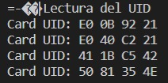

# Práctica 6b

El objetivo de la practica es comprender el funcionamiento del bus SPI.


## Código:

```
#include <Arduino.h>
#include <SPI.h>
#include <MFRC522.h>
 
#define RST_PIN 17    //Pin 9 para el reset del RC522
#define SS_PIN  5  //Pin 10 para el SS (SDA o CS) del RC522 (slave select)
MFRC522 mfrc522(SS_PIN, RST_PIN); //Creamos el objeto para el RC522
 
void setup() {
        Serial.begin(9600); //Iniciamos la comunicación  serial
        SPI.begin();        //Iniciamos el Bus SPI
        mfrc522.PCD_Init(); // Iniciamos  el MFRC522
        Serial.println("Lectura del UID");
}
 
void loop() {
        // Revisamos si hay nuevas tarjetas  presentes
        if ( mfrc522.PICC_IsNewCardPresent())
        {  
                //Seleccionamos una tarjeta
            if ( mfrc522.PICC_ReadCardSerial())
            {
                  // Enviamos serialemente su UID
                  Serial.print("Card UID:");
                  for (byte i = 0; i < mfrc522.uid.size; i++) {
                          Serial.print(mfrc522.uid.uidByte[i] < 0x10 ? " 0" : " ");
                          Serial.print(mfrc522.uid.uidByte[i], HEX);  
                  }
                  Serial.println();
                  // Terminamos la lectura de la tarjeta  actual
                  mfrc522.PICC_HaltA();        
            }      
        }      
}
```
---
## Descibir la salida por el puerto serie:

Este programa nos dice el UID de unas tarjetas gracias al lector de tags (MFRC522), simplemente por nuestro monitor saldrán 8 números o letras emparejados de 2 en 2 en notación hexadecimal, que serían el número identificador de estas tarjetas.



---

## Funcionamiento:
Para ejectuar el programa tenemos que declarar las librerias de "MFRC522" y declararlo:

```
#include <Arduino.h>
#include <SPI.h>
#include <MFRC522.h>
```
Ahora definimos los pines que vayamos a usar (en este caso el RST y el SDA).

Empezamos el setup iniciando la comunicación des del bus SPI y el sensor, despues imprimimos por pantalla el número que salga de la tarjeta.

```
void setup() {
        Serial.begin(9600); //Iniciamos la comunicación  serial
        SPI.begin();        //Iniciamos el Bus SPI
        mfrc522.PCD_Init(); // Iniciamos  el MFRC522
        Serial.println("Lectura del UID");
}
```

La parte del loop basicámente revisa si pasamos la tajeta por delante del sensor y cuando esto sucede muestra por pantalla el UID de esa tarjeta. 

```
void loop() {
        // Revisamos si hay nuevas tarjetas  presentes
        if ( mfrc522.PICC_IsNewCardPresent())
        {  
                //Seleccionamos una tarjeta
            if ( mfrc522.PICC_ReadCardSerial())
            {
                  // Enviamos serialemente su UID
                  Serial.print("Card UID:");
                  for (byte i = 0; i < mfrc522.uid.size; i++) {
                          Serial.print(mfrc522.uid.uidByte[i] < 0x10 ? " 0" : " ");
                          Serial.print(mfrc522.uid.uidByte[i], HEX);  
                  }
                  Serial.println();
                  // Terminamos la lectura de la tarjeta  actual
                  mfrc522.PICC_HaltA();        
            }      
        }      
}
```